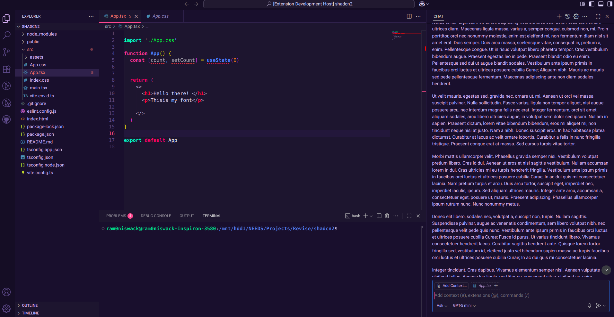
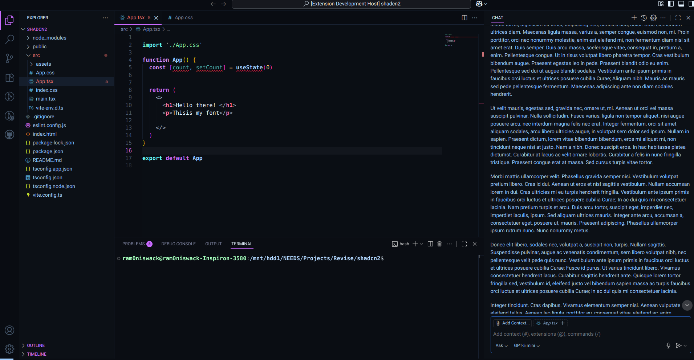
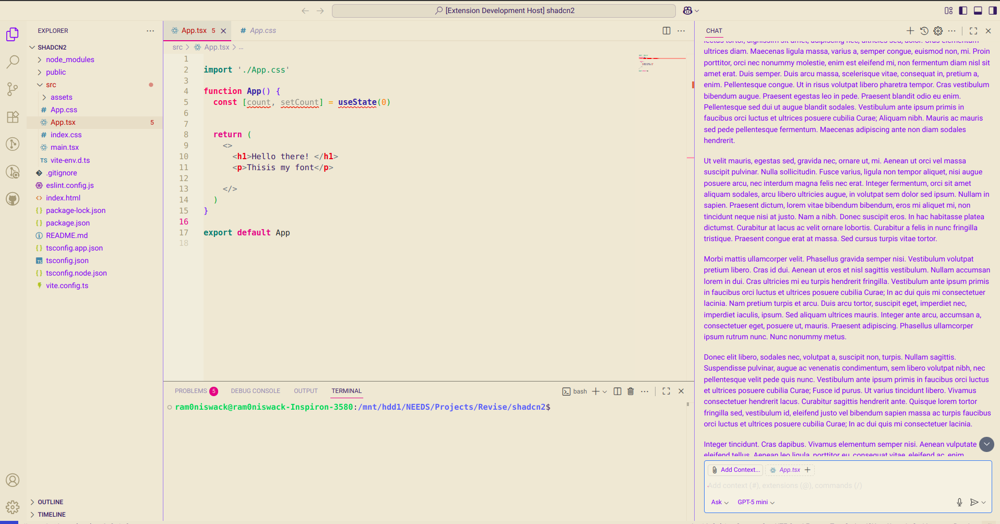
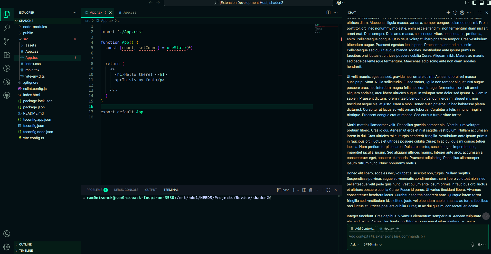

```markdown
# TaraMandal

## Short description (one line)

A cosmic-inspired VS Code theme collection with deep-space backgrounds and stellar accents for comfortable, focused coding.

## Long description

TaraMandal is a carefully crafted Visual Studio Code theme family inspired by nebulas, auroras and night skies. It includes dark and light variants plus an aurora palette for a calm but vivid coding experience.

Key points:

- High-contrast readable syntax highlighting
- Multiple theme variants (default, dark, light, aurora)
- Terminal color integration for consistent experience
- Lightweight — no runtime dependencies

## Features

- Balanced color contrast for long sessions
- Distinct token colors for readability
- UI theming for panels, status bar and activity bar
- Optional terminal background customizations

## Screenshots

I embed the screenshots from the `screenshots/` folder included in this repository. Here are the previews:









## Installation

1. Open VS Code
2. Go to Extensions (Ctrl+Shift+X)
3. Search for "TaraMandal" and click Install

Or manually install the `.vsix` from the releases page.

## Usage

- Open Command Palette (Ctrl+Shift+P) → Color Theme → Select "TaraMandal" or any variant from the list.
- For terminal background consistency, check the extension settings if enabled.

## Settings

This extension contributes one optional setting:

- `taramandal.terminalBackground` — set a custom terminal background color for the light theme (default `#FAF5ED`).

## Release notes / Changelog

See the project `CHANGELOG.md` for release notes and version history.

## Support

If you find issues or want to request color tweaks, open an issue on GitHub: https://github.com/Ramoniswack/TaraMandal-Theme/issues

## License

MIT — see the LICENSE file.

## Publisher information

Publisher: Ramoniswack
Marketplace item name: `ramoniswack.taramandal`

---

### Asset guidance (image requirements)

- Hero screenshot: 1280×720 PNG recommended
- Additional screenshots: 1280×720 PNG
- Icon: 128×128 PNG (already included as `logo/taramandal-logo.png`)
- Filenames should be lowercase and use underscores (no spaces)

When you upload your screenshots to `images/marketplace/`, tell me and I'll update this file to include the Markdown image links and repackage the `.vsix` including those assets.

```
